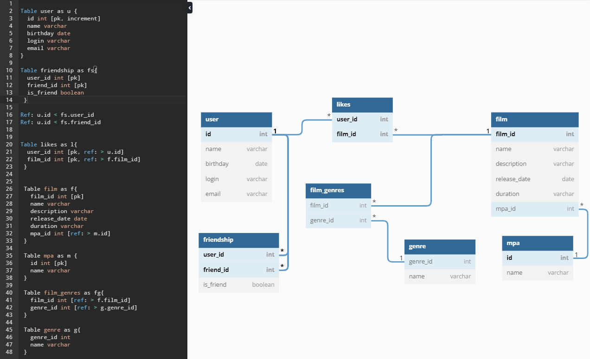

# java-filmorate
Filmorate project

Пример запросов к баззе данных:

Получить всех пользователей:
SELECT * 
FROM USERS

Получить пользователя по id
SELECT *
FROM USERS
WHERE id = n

Получить фильм по идентификатору:
SELECT * 
FROM FILMS
WHERE id = n

Получить первые n популярных фильмов
SELECT * ,
COUNT(user_id) 
FROM FILMS
RIGHT JOIN LIKES ON film.id = LIKES.film_id
GROUP BY film_id
ORDER BY user_id
LIMIT n 